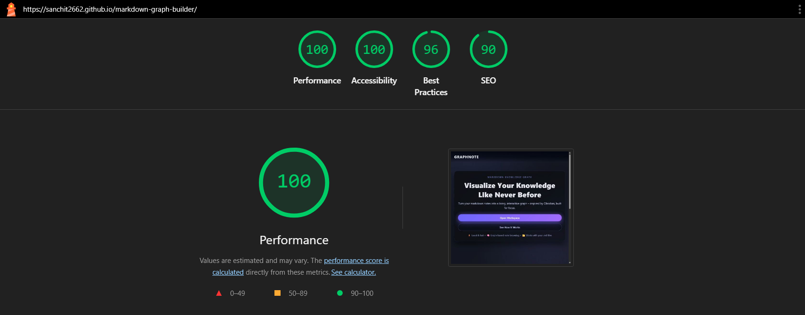

# markdown-graph-builder

# 🌐 Markdown Knowledge Graph Builder

A powerful Obsidian-style Markdown editor that automatically builds an interactive knowledge graph from your notes — helping you visualize relationships, link ideas, and organize your personal knowledge base.

---

## 🚀 Core Features

### 📝 Markdown Editor
- Real-time Markdown editing  
- Live preview using Marked.js  
- Supports wiki links `[[Note Title]]`  
- Syntax shortcuts (Ctrl+B, Ctrl+I, Ctrl+H)

### 🔗 Interactive Knowledge Graph
- Auto-generated graph using Vis.js  
- Nodes represent notes  
- Edges detected from wiki links  
- Click nodes to open notes instantly  
- Node sizes scale based on connection degree  

### 📁 Note Management
- Create new notes (`Untitled.md`, `Untitled 2.md`, `Untitled 3.md`, …)  
- Rename & delete notes  
- LocalStorage persistence  
- Import / Export all notes (JSON)  
- Upload `.md` files manually  
- Upload from Google Drive using OAuth Picker API  

### 🔎 Smart Search
- Search notes by title  
- Highlights matching graph nodes  
- Real-time filtering of the note list  

### 🖥️ Three-Pane Workspace
- Sidebar → Notes + Search  
- Center → Editor + Preview (resizable)  
- Right → Knowledge Graph  
- Panels fully resizable with dragbars  

### 🎨 Modern UI
- Dark, Obsidian-inspired theme  
- Glassmorphism styling  
- Purple/blue gradient landing page  
- Smooth scroll animations  
- Mobile responsive  

---

## 🗂️ Folder Structure

📦 project-root

├── index.html           # Landing page (hero + steps)

├── main.html            # Editor + graph workspace

├── script.js            # App logic

├── style.css            # Complete UI styling

├── assets/              # Optional images/icons

└── README.md

---

## ⚙️ How It Works

### 1️⃣ Landing Page  
Users start at a minimal, animated gradient landing screen → “Get Started” opens the main workspace.

### 2️⃣ Writing Notes  
Markdown updates in real-time with simultaneous preview.

### 3️⃣ Wiki Link Detection  
Your engine resolves links such as:

[[Note]]
[text](Note.md)

### 4️⃣ Graph Generation  
On every edit:
- Extracts wiki links  
- Generates nodes + edges dynamically  
- Updates the Vis.js Knowledge Graph  
- Highlights active & connected notes  

### 5️⃣ Google Drive Support  
Using:
- OAuth client  
- Google Picker API  
- Drive API v3  
to import `.md` files directly from Google Drive.

### 6️⃣ Persistence  
All notes and the last-opened note are saved to:

localStorage and restored automatically.

---

## 📈 Key Algorithms

### 🔍 Link Extraction Logic  
Supports:

[[Note]]
[text](Note.md)

### 🔗 Graph Model  
- Prevents duplicate edges  
- Ignores broken links  
- Degrees determine node size  

### 🧭 Session Restore  
Automatically opens:

localStorage.lastOpenedNote

---

## 🔮 Future Enhancements
- Cloud sync (Firebase / Supabase)  
- Real-time collaboration  
- Version history  
- Tag-based graph filtering  
- Export graph (PNG, SVG)  
- AI-powered link suggestions  
- AI note summarization  

---

## 🧪 Lighthouse Performance  
- Fast load time  
- Zero frameworks — pure JS, HTML, CSS  
- Fully responsive  
- 100 performance , 100 accessibity , 90 SEO , 96 best practice

---

## 🌍 Live Demo  
Add your hosted project link here:

- https://sanchit2662.github.io/markdown-graph-builder/

---

## 📄 License  
This project is for educational and research purposes.

---

## ❤️ Author  
Made with passion by **Sanchit and Mayank**

---

